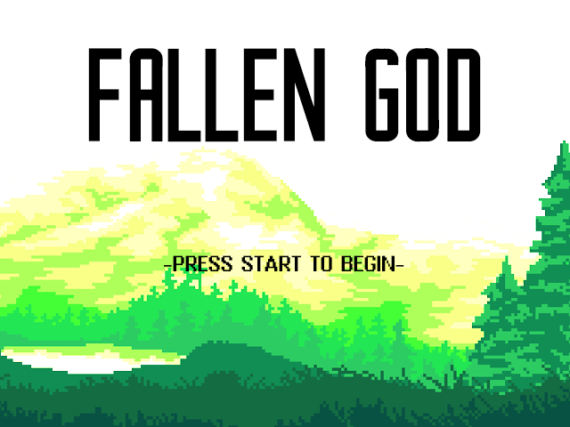

<h2 align="center">⚠️ THIS IS A MIRROR ⚠️</h2>

> [!WARNING]  
> Hi there! This is a **read-only mirror**, automatically synced from our Forgejo instance.  
>   
> - 🛠️ All development happens on the primary Forgejo repository  
> - 💬 You’re welcome to open Issues, Discussions, or even PRs here if it’s convenient — just know they may not be acted on directly, since the sync is one-way  
>   
> For the best chance of your contributions being merged, or for quicker responses, please head over to the main Forgejo repo.  
>   
> - Original repo: https://git.prisma.moe/aichan/fallen_god
>   
> — *Self-hosting 4 the win!*

---

<!-- PROJECT LOGO -->
<br />
<div align="center">
 <a href="https://git.prisma.moe/aichan/fallen_god">
   
 </a>

 <h1 align="center">Fallen God</h1>

 <p align="center">
 A retro-style action game rewritten in Rust. This is a modern rewrite of the original C version created as a university project in 2019, now using Rust with macroquad for cross-platform deploying.
 <br />
 <br />
 <a href="https://fallengod.aichan.ovh/">Play Demo</a>
 ·
 <a href="https://github.com/UN41/FALLEN_GOD">Original C Version</a>
 ·
 <a href="https://git.prisma.moe/aichan/fallen_god/issues">Report Bug</a>
 </p>
</div>

<!-- TABLE OF CONTENTS -->
<details>
 <summary>Table of Contents</summary>
 <ol>
 <li><a href="#about-the-project">About The Project</a></li>
   <ul>
      <li><a href="#original-project">Original Project</a></li>
      <li><a href="#built-with">Built With</a></li>
   </ul>
 </li>
 <li><a href="#deployment">Deployment</a></li>
   <ul>
      <li><a href="#using-docker">Using Docker</a></li>
   </ul>
   <ul>
      <li><a href="#using-docker-compose">Using Docker Compose</a></li>
   </ul>
 <li><a href="#development">Development</a></li>
   <ul>
      <li><a href="#prerequisites">Prerequisites</a></li>
      <li><a href="#running-locally">Running Locally</a></li>
   </ul>
 <li><a href="#contributing">Contributing</a></li>
 <li><a href="#license">License</a></li>
 <li><a href="#contact">Contact</a></li>
 </ol>
</details>

## About The Project

<div align="center">
  
</div>

Fallen God is a retro-style roguelike game where players battle through multiple levels against various enemies and bosses. This Rust rewrite maintains the spirit of the original 2019 university project with some minor improvements.

All game assets and design are preserved from the original version.

### Original Project

**[Fallen God](https://github.com/UN41/FALLEN_GOD)** was originally developed as a university game project in 2019 at Mondragon Unibertsitatea. The original was created by:
- [Unai Orive Mujika](https://github.com/UN41)
- [Daniel Luengo Echeverria](https://github.com/Danielluengo15)
- [Aitor Astorga Saez de Vicuña](https://github.com/AitorAstorga)
- [Danel Mazkiaran Hernandez](https://github.com/danmazkih)

**Note:** The original code was written in Basque, but the GUI remains in English.

For a presentation about the original game (in Basque): [Click here](https://docs.google.com/presentation/d/1c0PM4SX732tn3AuZbe6d2wMaMBtvkCX3diTZuFrCeew/edit?usp=sharing)

<p align="right">(<a href="#readme-top">back to top</a>)</p>

### Built With
 [](https://macroquad.rs/) 

<p align="right">(<a href="#readme-top">back to top</a>)</p>

## Deployment

You have multiple options to deploy Fallen God:

### Using Docker

Run the pre-built container:
```bash
docker run --rm -it \
  -p 8080:8080/tcp \
  git.prisma.moe/aichan/fallen_god:latest
```

### Using Docker Compose

Create a `docker-compose.yml` file:
```yaml
services:
  fallen_god:
    container_name: fallen_god
    image: git.prisma.moe/aichan/fallen_god:latest
    ports:
      - 8080:8080
    restart: unless-stopped
```

Then run:
```bash
docker-compose up -d
```

**Access Point:**
- Game will be served at `http://localhost:8080/`

<p align="right">(<a href="#deployment">back to top</a>)</p>

## Development

### Prerequisites

- Rust installed (includes Cargo)
- macroquad dependencies (platform-specific, see below)

**Linux:**
```bash
# Arch Linux
sudo pacman -S libx11 libxi mesa alsa-lib

# Ubuntu/Debian
sudo apt install pkg-config libx11-dev libxi-dev libgl1-mesa-dev libasound2-dev

# Fedora
sudo dnf install libX11-devel libXi-devel mesa-libGL-devel alsa-lib-devel
```

### Running Locally

1. Clone the repository:
   ```bash
   git clone https://git.prisma.moe/aichan/fallen_god.git
   cd fallen_god
   ```

2. Build and run the game:
   ```bash
   cargo run --release
   ```

3. Play the game!

**Development Notes:**
- Use `cargo run` for development builds (faster compilation)
- Use `cargo run --release` for optimized builds (better performance)
- Assets are loaded from the `img/` directory
- Game configuration can be modified in the source code

<p align="right">(<a href="#development">back to top</a>)</p>

## Contributing

Contributions are welcome! Please fork the repository, make your changes, and open a pull request.

1. Fork the Project on [Forgejo](https://git.prisma.moe/aichan/fallen_god)
2. Create your Feature Branch (`git checkout -b feature/AmazingFeature`)
3. Commit your Changes (`git commit -m 'Add some AmazingFeature'`)
4. Push to the Branch (`git push origin feature/AmazingFeature`)
5. Open a Pull Request

<p align="right">(<a href="#contributing">back to top</a>)</p>

## License

Distributed under the European Union Public License v1.2. See `LICENSE` for more information.

<p align="right">(<a href="#license">back to top</a>)</p>

## Contact

Aitor Astorga Saez de Vicuña - a.astorga.sdv@protonmail.com

Project Link: [https://git.prisma.moe/aichan/fallen_god](https://git.prisma.moe/aichan/fallen_god)

**Original Project Authors:**
- Unai Orive Mugika - unaiby18@gmail.com | [LinkedIn](https://linkedin.com/in/unai-orive-mujika-a638a6225)
- Daniel Luengo Echeverria - danielluengoecheverria@gmail.com | [LinkedIn](https://linkedin.com/in/daniel-luengo-echeverria-05b279224)
- Aitor Astorga Saez de Vicuña - a.astorga.sdv@gmail.com | [LinkedIn](https://linkedin.com/in/aitor-astorga-saez-de-vicuña)
- Danel Mazkiaran Hernandez - danel.mazkiaran@gmail.com | [LinkedIn](https://linkedin.com/in/danel-mazkiaran-hernandez-67a970248)

Original Project Link: [https://github.com/UN41/FALLEN_GOD](https://github.com/UN41/FALLEN_GOD)

<p align="right">(<a href="#contact">back to top</a>)</p>

## Acknowledgments

Thanks to these amazing projects and technologies!

- [macroquad](https://macroquad.rs/) - Simple and easy to use game library for Rust
- [Rust](https://www.rust-lang.org/) - A language empowering everyone to build reliable and efficient software
- Original Fallen God team

**Original Project Credits:**
- [Best-README-Template](https://github.com/othneildrew/Best-README-Template)
- The original C version

<p align="right">(<a href="#readme-top">back to top</a>)</p>

---

> [!WARNING]
> **🔗 This repository is automatically mirrored from a private Forgejo instance.**